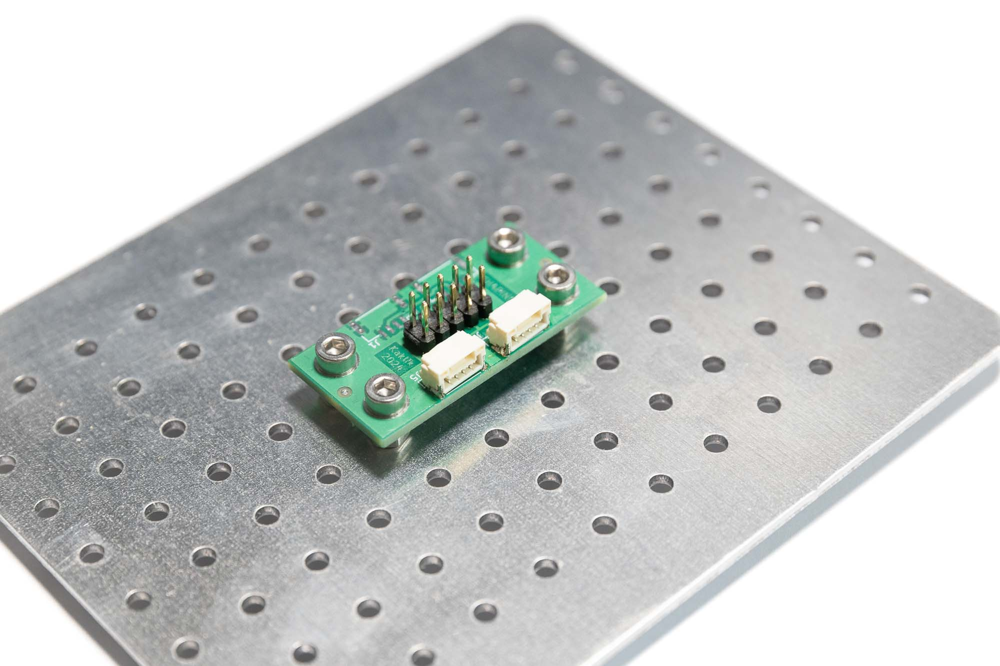

#  GH4PIN01 - MLAB to PixHawk 4PIN interface

The module enables the connection of [PixHawk standard compatible devices](https://github.com/pixhawk/Pixhawk-Standards/blob/master/DS-009%20Pixhawk%20Connector%20Standard.pdf) with MLAB modules. The module can also be used as an I2C or CAN converter. 

